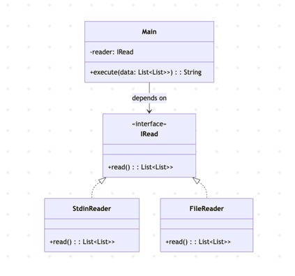

# Triangle Challenge

This application makes use of Bottom Up Dynamic algorithm with History Tracking to find the minimum path sum of a triangle represented as a `List[List[Int]]` that comes from the user input in `Stdin`.</p>
Since an additional `data_small.txt` and `data_big.txt` files were provided the application was designed as able to handle multiple input sources, this was very useful during Q&A to benchmark the solution against different inputs.</p>



## Running

In order to run the application, perform:
- `sbt run` at root of the project;
- input each row of the triangle and press enter at the end of each row, separating each `Integer` by space;
- when there are no more rows type `EOF` and press enter (optionally you can leave the row empty and press enter).

Below you will find an example

```
<path/to/root/of/project> sbt run
[info] running codechallenge.TriangleChallenge
7
6 3
3 8 5
11 2 10 9
EOF
Minimal path is: 7 + 6 + 3 + 2 = 18
```

## Testing

- Validations are performed on the `Stdin` user input to ensure these are valid.

- [ScalaTest](https://www.scalatest.org/) is used as testing framework.

## Next Steps
- Current solution presents a O(n^3), this could be further improved to reach a O(n^2).
- A `var` map was used as to save the history, in FP making use of mutable variables is not recommended and therefore a more functional approach should be found to overcome this tech debt.